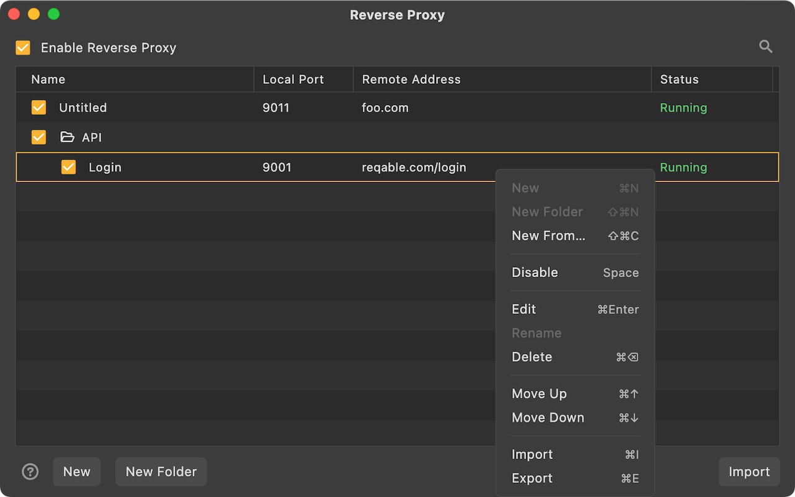

# Reverse Proxy

Reqable creates a local web server and transparently proxies traffic to the remote server. At the same time, Reqable will capture the traffic and support debugging features such as rewriting, scripting, and breakpoints.

### How it works?

Developers need to configure in Reqable: a local Web server port (such as `9001`) and the proxied remote server address (assumed to be `test.com`). After the configuration is complete, Reqable will automatically create this local web server, listening on port `9001`. The developer changes the request url from `https://test.com` to `http://localhost:9001` in the code, and all requested traffic will be sent to the local web server. The local web server transparently forwards traffic to the actual remote server `test.com`. During this process, Reqable will intercept the traffic and display it in the traffic list.

If you are debugging on a remote device, you need to replace `localhost` above with the IP address of the PC device (such as `192.168.1.3`). This IP address will generally be displayed at the top of the Reqable main window.

### Usage Scenario

The network framework of some applications may not support setting a network proxy, or may not support using the network proxy in the system settings. In these cases, Reqable will not be able to perform traffic analysis and debugging on it. Reverse proxy is used to solve such problems.

:::info
If the application network framework you are using supports proxy configuration, then directly configuring the MITM proxy server address as Reqable will be more efficient than using the `Reverse Proxy`.
:::

Using a reverse proxy also has the following advantages:
- The original HTTPS request becomes a clear text request to communicate with the local web server, so the client no longer needs to install the CA root certificate.
- The remote device only needs to ensure that it is in the same LAN as the PC device, and there is no need to set up a Wi-Fi proxy.

Using a reverse proxy has the following disadvantages:
- Network request efficiency using reverse proxy will be reduced.
- Reqable currently does not support reverse proxy for WebSocket.

### How to use

Reqable supports configuring and managing multiple reverse proxies. We can create a reverse proxy from the right-click menu of the proxy icon or from the `Proxy` menu at the top of the application.

Enter the `Name`, `Local Port` and `Remote Address` as shown below. By default, Reqable will automatically select a local port. If you find that the port is occupied, please modify it manually. If the `Remote Address` uses a default port number (HTTP defaults to 80, HTTPS defaults to 443), it can be ignored. If a non-default port number is used, it cannot be ignored, such as `reqable.com:3000`.

:::caution
- `Preserve Host in Header` allows you to preserve the original Host value. You should use it with caution because your remote server can reject the request due to a mismatched Host value.
- For the remote device (such as a mobile phone or tablet), please make sure that PC network firewall has opened the set `Local Port`.
:::

After the reverse proxy is created, it can be managed in the list below. In the list, the status of each reverse proxy local server will be displayed in real time. If you find that the status fails (most likely because of a local port conflict), you can click to enter the edit page to modify it.

