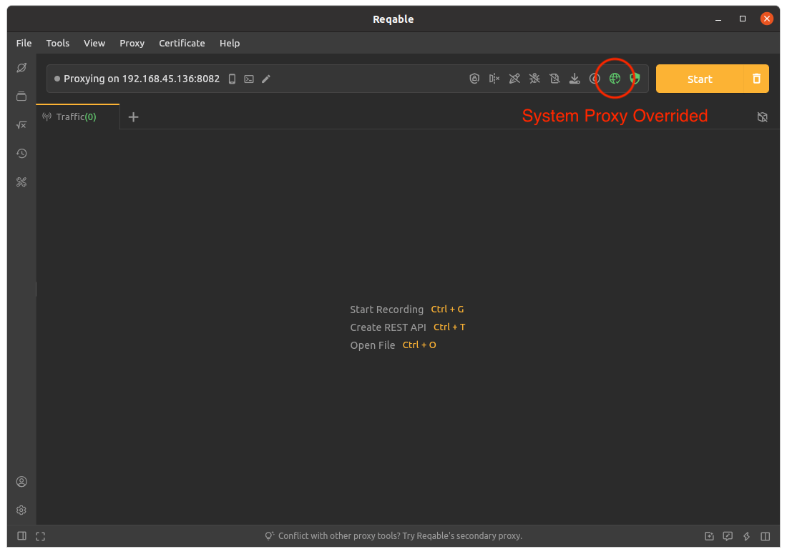
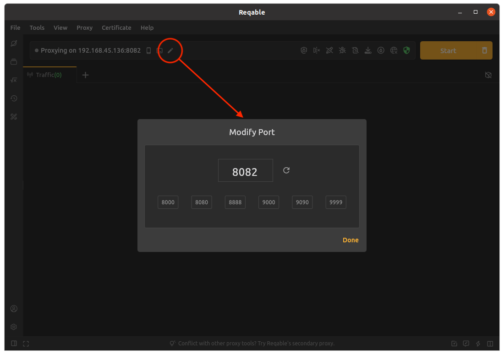

# Linux FAQs

:::info
Please update Reqable to the latest version before troubleshooting.
:::

### 1. Reqable cache directory

```
~/.local/share/reqable
```

### 2. Reqable log files

```
~/.local/share/reqable/log
```

:::note
Click the bottom bar of Reqable 5 times to open the log console to view the current log.
:::

### 3. Chrome and Safari prompts unsafe website

Firefox and Safari use the built-in CA Store. The CA certificate installed by the system cannot take effect. You need to follow the Firefox certificate installation guide in the Reqable to install it.


### 4. Unable to capture traffic from PC applications

Please make sure the following actions have been processed first.

- Capture button has been turned on.
- All filtering and search conditions have been removed.
- [Secondary Proxy](../../capture/proxy#secondary) has been turned off.

Then you can follow the steps below to troubleshoot.

#### 4.1 Check whether the system proxy is configured

Reqable needs to configure the network proxy in system settings, and other applications need to access Reqable's proxy server through the system's network proxy configuration. If the system network proxy is configured, the network icon in Reqable will be displayed in green.



Manually check whether the network proxy is configured successfully in the system settings, System Settings -> Network -> Proxy -> Manual, check whether `HTTP Proxy`, `HTTPS Proxy`, `Socks Proxy` address is `127.0.0.1` and port is the port number displayed at the top of the Reqable main window.


If the network icon is green, but the manual check of the network proxy in the system settings is unsuccessful, you can report it to us on [Github](https://github.com/reqable/reqable-app/issues).

If there is no issue with the system proxy configuration, please proceed to the next step.

#### 4.2 Check if can capture the browser's traffic

After Reqable starts the capture, open the browser (Chrome or Edge is recommended) and visit the www.google.com.

Case 1: Google cannot be accessed, and no traffic (including CONNECT requests) can be seen.

It may be that the Reqable proxy server port is broken (for example, occupied by other program processes). You can try to change the port and try again.



If your browser still cannot access Google after changing the port, please report it to us on [Github](https://github.com/reqable/reqable-app/issues).

Case 2: Google is accessible, but no traffic (including CONNECT requests) can be seen.

Check again whether the system network proxy is configured correctly in 4.1 above, or try to restart the browser, or try to restart PC. If this situation still occurs, please report it to us on [Github](https://github.com/reqable/reqable-app/issues).

Case 3: Google is accessible, and traffic (including CONNECT requests) can also be seen.

This means that Reqable is working properly, but the application does not use the system network proxy to access Reqable's proxy server. You can handle it as follows.

- If the application is a script process such as Python, NodeJS or Ruby, you can try to use the [Proxy Terminal](../../capture/proxy-terminal).
- Check whether the application supports manual setup network proxy.
- Try to use third-party software such as Proxifier for forced proxy.
- Contact the application owner for a solution.

### 5. Unable to capture localhost traffic

By default, localhost traffic will not go through the system network proxy and needs to be specially processed using the mirroring feature. Please refer to [localhost traffic](../../capture/localhost).

### 6. The mobile device cannot connect to PC

- Check if the mobile and PC are in the same LAN.
- Check if the mobile and PC are in the same LAN segment. Some LANs prohibit cross-segment communication when networking.
- Try connecting the PC to the mobile's hotspot, and then scan the QR code on the mobile to connect to the PC.
- Check if the system firewall has disabled the inbound and outbound traffic of the Reqable proxy port number.