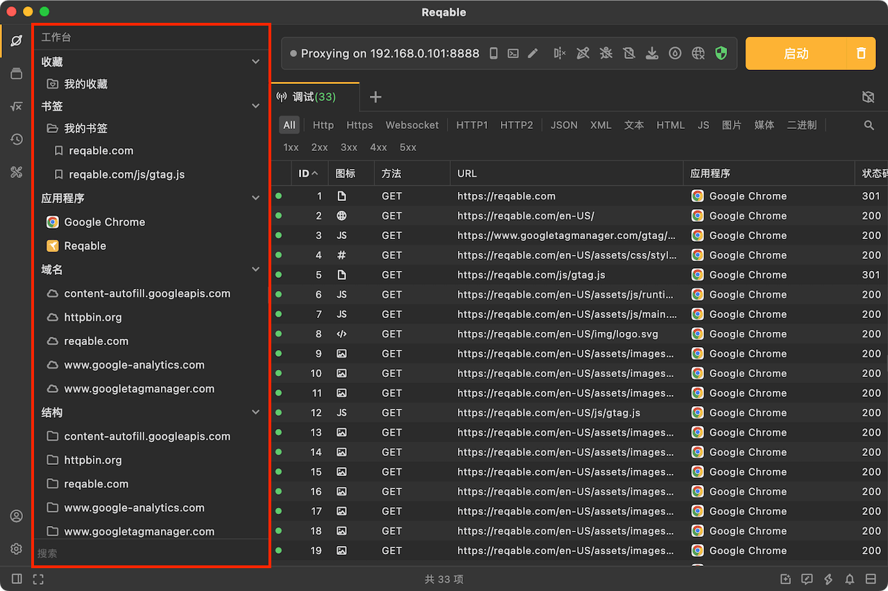
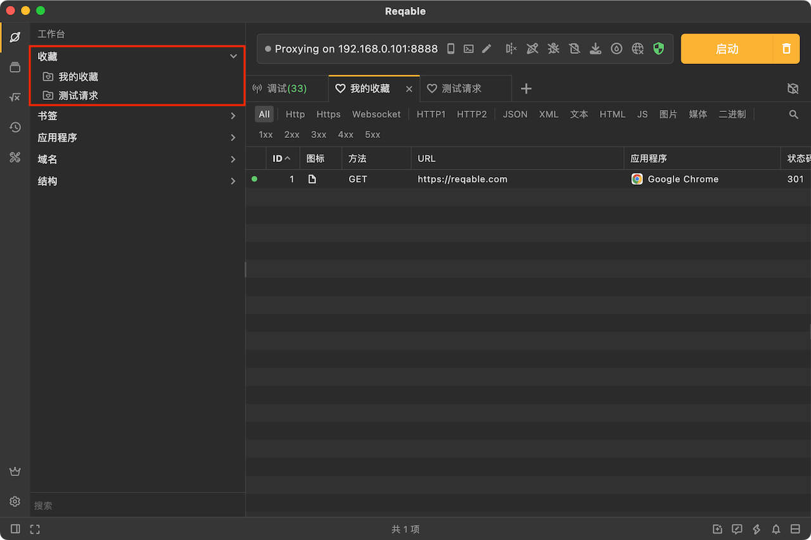
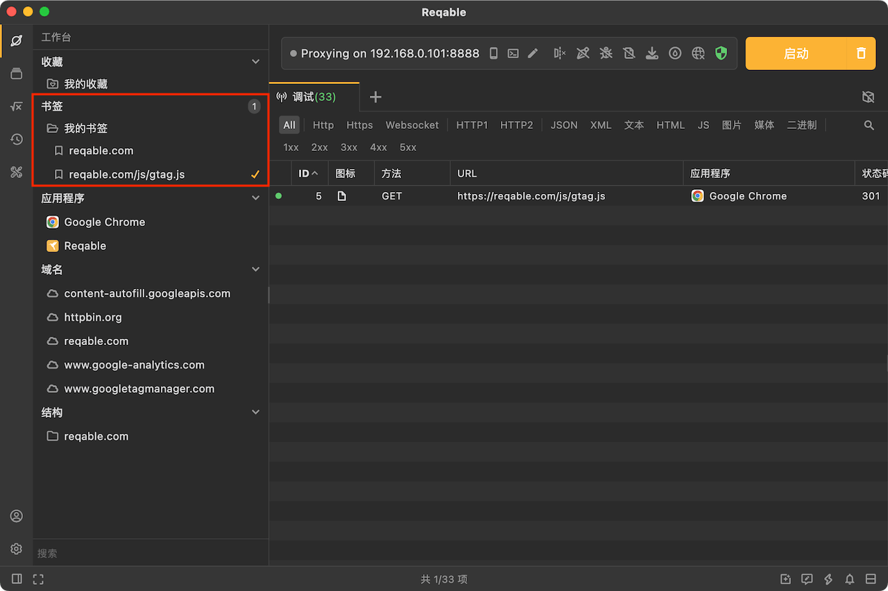
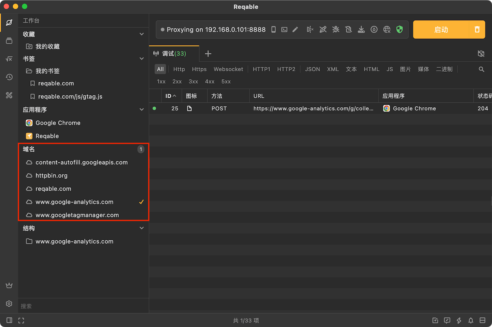

# 工作台

除了主内容区域操作外，Reqable还提供了**工作台**侧边栏用于辅助操作。点击侧边栏的第一个图标，可以打开工作台面板。工作台中包含五个部分：[收藏](#favorite)、[书签](#bookmark)、[应用程序](#application)、[域名](#domain)和[结构树](#structure)。



### 收藏 {#favorite}

用户可以在[调试列表](./list)中将请求记录添加到收藏文件夹（右键菜单 -> 添加到 -> 收藏文件夹），在工作台中可以打开收藏文件夹查看和管理已收藏的请求记录。Reqable默认内置了`我的收藏`文件夹，用户也可以自行创建自定义的收藏文件夹。



### 书签 {#bookmark}

书签用于快速筛选请求，书签通过文件夹（目前只支持单级目录）的方式进行管理。文件夹右键可以新建书签，我们还可以从[调试列表](./list)中的请求直接创建书签。Reqable默认内置了`我的书签`文件夹，用户也可以自行创建自定义的书签文件夹。

书签按照目录结构过滤请求，例如 `https://reqable.com/zh-CN/` 可以过滤出下面的所有请求：

```
https://reqable.com/zh-CN/img/logo.svg
https://reqable.com/zh-CN/assets/css/styles.7bbae746.css
```

即只要是域名 `reqable.com` 中 `zh-CN` 目录下的请求都会被过滤出来。如果书签是域名本身，那么此域名下面的所有请求都会被过滤出来。



### 应用程序 {#application}

应用程序用于快速筛选请求，和[书签](#bookmark)是**或**的逻辑关系。工作台中会显示出列表中全部的应用程序（未检测到应用程序来源的流量将会以IP源地址显示），用户可以根据实际情况选择一个或者多个应用程序进行过滤，未选择的情况下列表将会显示全部。


:::info 小技巧
- 双击可以单选。
- 点击数字可以取消全部选择。
- 右键可以`固定`应用程序到顶部并一直保留。
:::

### 域名 {#domain}

域名同样用于快速筛选请求，和[应用程序](#application)和[书签](#bookmark)是**或**的逻辑关系。工作台中会显示出列表中全部的域名数据，用户可以根据实际情况选择一个或者多个域名进行过滤，未选择的情况下列表将会显示全部。



### 结构树 {#structure}

结构树是列表的另一种展现形式，以文件目录的形式展示流量内容，在某些时候比列表更加直观。在结构树中点击请求，同样可以展开详情面板。


另外，对于文件目录右键还可以此目录下的全部请求进行批量操作。

### 搜索

在底部搜索输入框可以对[域名](#domain)和[应用程序](#application)进行快速筛选。

