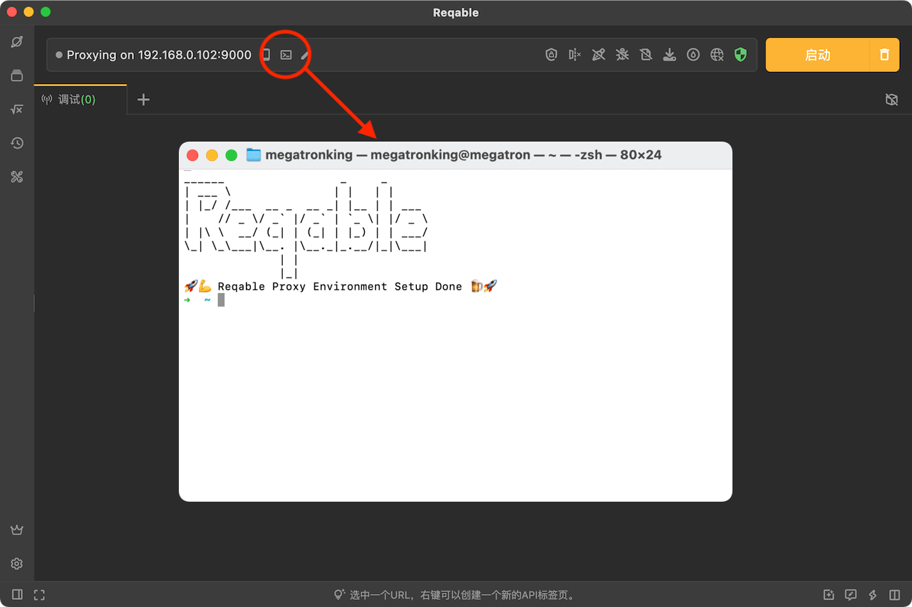
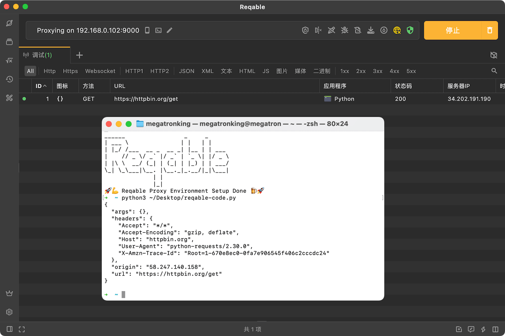

# 代理终端

在命令行中发送HTTP请求或者运行程序的时候，这些请求的流量不会经过Reqable。之前的处理方式是，手动在命令行终端配置环境变量（例如HTTP_PROXY），或者在脚本代码中指定代理地址。这些方式虽然能工作，但是需要手动处理，繁琐效率低。

另外，很多脚本的网络框架不信任系统安装的CA证书，设置完抓包代理后请求还会报错，比如Python的requests网络框架。

Reqable提供了代理终端功能，可以一键启动终端并且自动配置好代理环境和解决CA证书信任问题。

:::info
使用此功能需要更新Reqable到v2.26.0及以上版本。
:::

### 使用方式

从应用顶部快捷操作栏可以点击图标启动终端窗口（快捷键`Alt` + `T`），或者从应用**工具**菜单中启动。启动的终端窗口会显示`Reqable`的艺术字以及可以出现配置成功的提示。

在自动打开的终端窗口中执行命令发送网络请求的流量可以被Reqable拦截，显示在调试列表中。

- 在Mac系统上，支持Apple官方的Terminal终端。
- 在Windows系统上，支持CMD（默认）终端和PowerShell（图标右键菜单中可以切换默认启动终端）。
- 在Linux系统上，支持Ubuntu的gnome console和KDE的konsole。

代理终端目前支持下列网络框架：

- NodeJS的axios、got、fetch等网络库.
- Python的request、requests、aiohttp、httplib网络库.
- Ruby的http、net/http网络库.

